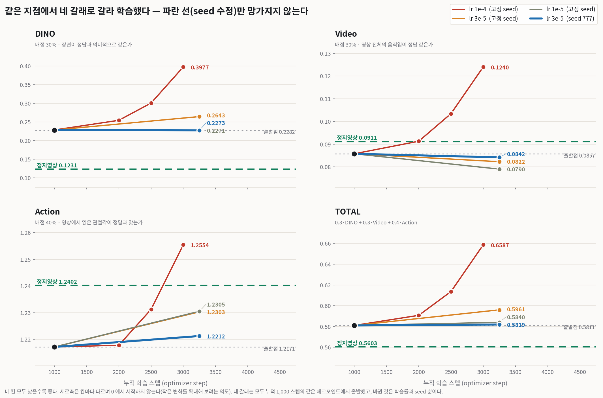

# 001 — branch B(1.1B 잠재확산) 학습 동결 (2026-08-01 16:11)

> 결정: **학습을 중단하고 GPU 를 다른 노선으로 돌린다.**
> 상세 서술: [016 §9.1](../model_select/016-seed_bug_and_leaderboard_truth.md)

## 판정선 (결과를 보기 전에 고정했다)

```
  DINO 개선 ≥ 0.0167 이고 t ≤ −2   →  B 생존, 계속 학습
  그 외                              →  B 동결
```

`0.0167` 은 홀드아웃 96표본에서 짝지은 DINO 차이 표준오차(0.00834)의 2배,
즉 **검출 가능한 최소 변화**다. 이 선을 고른 이유:

```
  static 까지 필요한 감소량   DINO 0.22825 → 0.15916  (−0.069)
  1000스텝당 0.0167(겨우 검출되는 최소치)씩만 줄어도 → 4,000스텝 = 약 5.9시간이면 도달
```

**"겨우 보일 만큼만 좋아져도" 하룻밤이면 따라잡는다.** 뒤집으면
**1,000스텝에서 유의한 개선이 없으면 남은 19일에도 없다.**

## 결과 — 다섯 갈래 전부 출발점보다 나빠졌다



| 설정 | 스텝 | DINO | 출발점 대비 |
|---|---:|---:|---|
| **출발점 (누적 1000)** | — | **0.22825** | — |
| lr 1e-4 · 고정 seed | 1,000 | 0.25428 | 악화 |
| lr 1e-4 · seed 999 | 1,000 | 0.31462 | 악화 (t=+8.76) |
| lr 3e-5 · 고정 seed | 2,250 | 0.26430 | 악화 (t=+4.91) |
| lr 3e-5 · seed 777 | 2,250 | 0.22726 | 변화 없음 (t=−0.16) |
| lr 1e-5 · 고정 seed | 2,250 | 0.22712 | 변화 없음 (t=−0.19) |

**판정 근거가 된 실측**: DINO 0.22825 → **0.31462**, 즉 **+0.08638 (t=+8.76, 96표본 중 17승)**.
개선은커녕 크게 악화했다. → **B 동결.**

## 같이 남기는 것 — seed 대조 실험의 짝지은 비교 출력

이 출력이 중요한 이유는 결과가 아니라 **결론이 뒤집힌 기록**이기 때문이다.
아침에 "붕괴의 범인은 고정 seed"라고 결론냈다가, 같은 실험을 다른 학습률에서
반복하니 **부호가 반대로 나와** 그 결론을 취소했다.

```
A = 누적2000 seed999   B = 누적2000 고정seed   공통 표본 96개

성분            A평균       B평균        A−B       ±SE       t      A승률  판정
------------------------------------------------------------------------------
DINO      0.31462   0.25428   +0.06035   0.01017   +5.94   16/96   B가 유의하게 좋다
Video     0.11116   0.09127   +0.01989   0.00446   +4.46   32/96   B가 유의하게 좋다
Action    1.21281   1.21779   -0.00498   0.01198   -0.42   43/96   구분 안 됨(노이즈)
TOTAL     0.61286   0.59078   +0.02208   0.00496   +4.45   26/96   B가 유의하게 좋다
```

앞선 다른 쌍(lr 3e-5, 2250스텝)에서는 seed 를 바꾸니 **좋아졌었다**(t=−5.80).
여기서는 **나빠졌다**(t=+5.94). 둘 다 |t| 가 6 근처로 "유의"하다.

> **⇒ 지금 데이터가 지지하는 명제는 "범인이 seed 다"가 아니라
> "런마다 결과가 크게 흔들리고 어느 쪽으로 갈지 예측되지 않는다"이다.**
>
> **교훈**: 짝지은 t 검정은 **표본 간 편차**만 다루고 **런 간 편차**는 다루지 않는다.
> 96표본에서 t=6 이 나와도 "이 두 런은 다르다"일 뿐 "이 인자가 원인이다"가 아니다.
> **원인 주장에는 반복이 필요하다.**

## 보존된 것 (이 컴퓨터에만)

```
  artifacts/branchB/ckpt_snapshots*/          체크포인트, 250스텝 간격, 각 7.9GB
  artifacts/branchB/m0_*/m0_report.json       채점 결과 (표본별 rows 포함)
  run_logs/20260801_*.log                     학습·채점 로그
```

체크포인트는 **동결됐으므로 C 작업에는 필요 없다.** 노선을 되돌릴 때만 쓴다.
