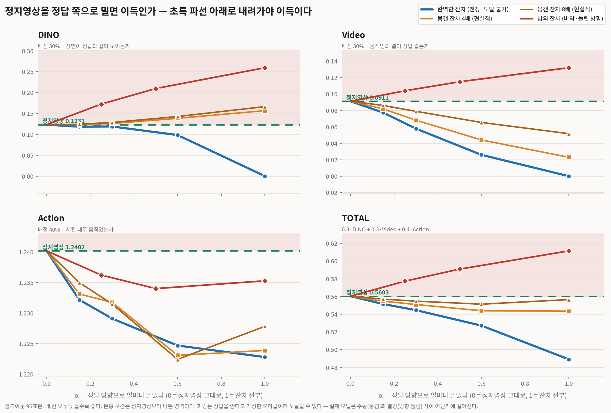

# 002 — 잔차 보정 노선 채택 (2026-08-01 16:28)

> 결정: **영상을 새로 그리지 말고 "정지영상 + 잔차"로 간다.**
> 상세 서술: [016 §9.2 / §9.2-c](../model_select/016-seed_bug_and_leaderboard_truth.md)

## 무엇을 물었나

`branch B` 를 동결한 뒤 다음 노선을 정해야 했다. 후보는 **잔차 보정**이다.

```
  출력 = 입력 프레임 + 신경망이 만든 잔차(0 으로 초기화)

    학습 0스텝  →  출력이 정확히 static  = 리더보드 0.30325 (현재 최고 제출물)
    실패        →  static 폴백, 손해 0
```

3일을 걸기 전에 물어야 했다 — **조금 미는 게 정말 이득인가?**
모델 없이 잴 수 있다. 홀드아웃에는 정답 영상이 있기 때문이다.

**두 가지를 재서 위아래로 가둔다.**

```
  ① 천장 — 방향이 완벽할 때    예측 = static + α × (정답 − static)
  ② 바닥 — 그럴듯하지만 틀릴 때  예측 = static + α × (**다른 표본**의 잔차)
                                       └ 행동 시퀀스가 가장 비슷한 표본
```

①만으로는 안 된다. 방향이 완벽한 오라클이라 **반증에는 쓸 수 있어도 검증에는 못 쓴다.**
②를 붙여야 현실적인 바닥이 생겨 **위아래로 가둘 수 있다.**

## 결과 (n=96, 전부 낮을수록 좋다)



```
잔차 보정의 천장과 바닥 (n=96)
------------------------------------------------------------------------------------
변형                          DINO     Video    Action     TOTAL    static 대비
------------------------------------------------------------------------------------
정지영상 (α=0)               0.12308   0.09110   1.24017   0.56032     +0.00000
완벽한 잔차 α=0.15            0.11819   0.07726   1.23216   0.55150     -0.00883
완벽한 잔차 α=0.3             0.11875   0.05777   1.22909   0.54459     -0.01573
완벽한 잔차 α=0.6             0.09832   0.02591   1.22466   0.52713     -0.03319
완벽한 잔차 α=1              -0.00000   0.00000   1.22277   0.48911     -0.07121   ← 천장
뭉갠 잔차(4배) α=0.15         0.12303   0.08176   1.23311   0.55468     -0.00564
뭉갠 잔차(4배) α=0.3          0.12614   0.06805   1.23174   0.55095     -0.00937
뭉갠 잔차(4배) α=0.6          0.13831   0.04404   1.22306   0.54393     -0.01639
뭉갠 잔차(4배) α=1            0.15664   0.02297   1.22386   0.54343     -0.01690   ← 현실적
뭉갠 잔차(8배) α=0.15         0.12418   0.08597   1.23498   0.55704     -0.00328
뭉갠 잔차(8배) α=0.3          0.12836   0.07882   1.23147   0.55474     -0.00558
뭉갠 잔차(8배) α=0.6          0.14259   0.06530   1.22241   0.55133     -0.00899
뭉갠 잔차(8배) α=1            0.16634   0.05167   1.22781   0.55653     -0.00380
남의 잔차 α=1                0.25933   0.13187   1.23527   0.61147     +0.05115   ← 바닥
남의 잔차 α=0.5              0.20954   0.11482   1.23400   0.59091     +0.03058
남의 잔차 α=0.25             0.17227   0.10385   1.23622   0.57732     +0.01700
------------------------------------------------------------------------------------
```

원자료: `results/branchB/residual_headroom.json`

## 읽어낸 것

**① 위아래 폭이 0.034 뿐이고 0 이 그 한가운데 있다** (−0.017 ~ +0.017).
방향을 얼마나 맞히느냐에 따라 **이득도 되고 손해도 된다.**

**② 우리 확산모델의 좌표**: 로컬에서 static 대비 **+0.02073**.
남의 잔차 곡선의 **α≈0.35** 지점이 딱 그 값이다.

> 우리 모델의 움직임은 "비슷한 다른 표본의 움직임을 35% 세기로 갖다 붙인 것" 만큼의 값어치를 한다.

일반적인 움직임의 생김새는 배웠지만 **이 장면에서 무슨 일이 일어나는지는 못 배웠다.**

## ⚠ 채택 근거는 성능이 아니라 **위험 구조**다 — 이 구분을 흐리지 마라

```
  잠재확산 (측정된 실제 모델)      eval  +0.053    ← 진짜 모델이 낸 진짜 점수
  잔차 (방향 완벽 + 뭉갬, 오라클)  로컬  −0.017    ← 방향을 안다고 **가정한** 값
  잔차 (방향 틀림, 남의 잔차)      로컬  +0.017 ~ +0.051
```

**윗줄과 아랫줄은 급이 다르다.** 하나는 실측이고 하나는 오라클이다.
**"잔차가 더 좋은 점수를 낸다"는 근거가 아직 없다.**

| | 잠재확산 | 잔차 |
|---|---|---|
| 확실한 비용 | VAE 세금 0.045 (측정됨, 제거 불가) | 없음 |
| 반쯤 학습된 상태 | 쓰레기 영상 | **정확히 static** |
| 실패 시 손해 | 0.053 (실측) | **0** (폴백이 곧 현재 최고 제출물) |

**확실한 손해를 불확실한 손해로 바꾸는 거래**다.
"더 좋을 것 같아서"가 아니라 **"더 못해질 수가 없어서"** 다.

## 이후 갱신 (8/1 저녁 ~ 밤)

이 문서의 두 수치가 나중에 정정됐다.

| 여기서 | 나중에 | 어디서 |
|---|---|---|
| "현실적 이득 −0.01690 (뭉갬 4배)" | 배율 4는 **임의의 작동점**이었다. 2배는 −0.03798 | [003](./003-warp_vs_add.md), [006](./006-direction_over_resolution.md) |
| "이득의 출처는 DINO 가 아니라 Video" | **k=4 에서만 그렇다.** k=2 에서는 DINO 도 이득 | [006](./006-direction_over_resolution.md) |
| "우리 모델 = 남의 움직임 35% 세기" | 더 정확히는 **"방향이 절반쯤 섞임"(α≈0.5)** | [006](./006-direction_over_resolution.md) |

⚠ 그리고 [006](./006-direction_over_resolution.md) 이 이 문서의 α 축을 **두 개로 쪼갠다** —
"세기가 약함"과 "방향이 섞임"은 **정반대로 행동한다.**
