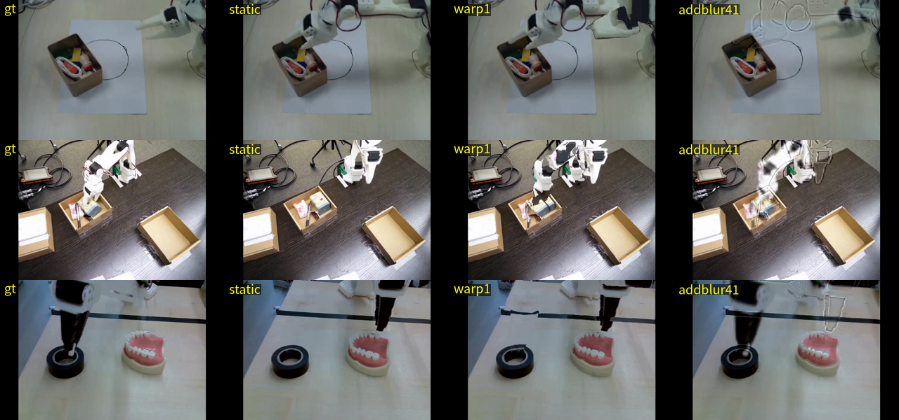

# 003 ⭐ — 덧셈 잔차 확정, 순수 워핑 배제 (2026-08-01 17:44 ~ 21:06)

> 결정: **출력 = 첫프레임 + 잔차. 워핑은 쓰지 않는다.**
> 상세 서술: [018](../model_select/018-warp_vs_add_verdict.md)
> 원자료: `results/branchC/warp_vs_add.json`, `warp_round2_raft.json`,
> `warp_round2_farneback.json`, `round3.json` (전부 표본별 rows 포함)

## 무엇을 물었나

잔차 노선을 정한 뒤 첫 갈림길이었다.

```
  덧셈    출력 = 첫프레임 + 잔차
          장점: 없던 것도 만든다 (팔을 지우고 뒤 배경을 그린다)
          단점: 신경망이 만드는 잔차는 저주파라 흐릿하다

  워핑    출력 = 첫프레임 픽셀을 흐름대로 밀어 옮긴 것
          장점: 원본 픽셀을 옮기니 선명하다
          단점: 가려졌다 드러나는 자리를 못 채운다
```

어느 단점이 큰지는 **로봇 팔의 화면 점유 면적과 배경 복잡도**에 달렸다 —
우리 데이터에만 있는 정보다. 문헌은 일반론만 준다.

---

## 1. 눈으로 본 답 (이게 가장 이해가 빠르다)



**움직이는 영상 두 개를 반드시 같이 보라.**

| 영상 | 장면 | 무엇이 보이나 |
|---|---|---|
| `img/20260801_2340_compare_A_arm_exits.mp4` | 팔이 화면 밖으로 나간다 | **워핑 실패.** 팔이 안 지워진다 |
| `img/20260801_2340_compare_B_gripper_descends.mp4` | 집게가 화면 안에서 내려온다 | **워핑 성공.** 선명하게 잘 옮긴다 |

배치는 2×2, 3배 느리게, 3회 반복:

```
  ① 정답                      ② 정지영상 (넘어야 할 선)
  ③ 워핑                      ④ 덧셈
```

### 워핑이 팔을 못 지우는 이유

역방향 워핑은 **"이 자리에 올 픽셀을 첫 프레임 어디서 가져올까"** 를 묻는다.
그런데 팔이 비켜난 자리의 배경은 **첫 프레임에서 팔에 가려져 화면 어디에도 없다.**
없는 걸 가져올 수 없으니 흐름 추정기는 0 에 가까운 값을 내고, **팔이 그대로 남는다.**

덧셈은 다르다. 잔차가 팔 자리에서 **음수**라 팔을 지우고, 배경 자리에서 **양수**라 배경을 그린다.
**없던 것을 만들 수 있다.**

문헌이 이 현상에 이름을 붙여 뒀다 — SDC-Net 의 **"foreground stretching"**:
> "backward 워핑은 구멍을 안 남긴다. 대신 **조용히 틀린 픽셀을 채운다.**"

> ⚠ **B 영상이 중요한 이유**: 워핑이 원리적으로 나쁜 게 아니다.
> **우리 데이터의 주된 변화가 "가려진 것이 드러나는" 종류라서** 안 맞는 것이다.

---

## 2. 1라운드 — 사전 등록한 킬스위치가 발동했다

**판정선을 결과 보기 전에 고정했다.**

```
Gate 0 (킬스위치)  Δ₀ = TOTAL(warp:1) − TOTAL(addblur4:1)
                   Δ₀ ≥ 0 이고 t₀ ≥ +2  →  워핑 폐기. Gate 1·2 무관하게 덧셈 확정
Gate 1 (주 판정)   Δ₁ = TOTAL(warpc4:1) − TOTAL(addblur4:1)   (둘 다 4배 뭉갠 짝)
                   Δ₁ ≤ −0.005 & t₁ ≤ −2 → 워핑 / ≥ +0.005 & ≥ +2 → 덧셈 / 그 외 무승부
```

### 재현 검증부터 (통과)

| 변형 | 016 §9.2 | 이번 측정 | |
|---|---:|---:|:---:|
| 정지영상 TOTAL | 0.56032 | 0.56032 | ✅ |
| 완벽한 잔차 α=1 | −0.07121 | −0.07121 | ✅ |
| 뭉갠 잔차 4배 α=1 | −0.01690 | −0.01690 | ✅ |
| 남의 잔차 α=0.25 | +0.01700 | +0.01700 | ✅ |

⚠ 다만 이건 **독립 재현이 아니다.** 016 의 `blur_residual` 을 그대로 import 하므로
같은 값이 나오는 것은 필연이다. "파이프라인이 결정론적이다"의 확인일 뿐이다.

### 결과 (n=96)

```
변형                              DINO     Video    Action     TOTAL    static 대비
정지영상 (α=0)                   0.12308   0.09110   1.24017   0.56032     +0.00000
워핑(원본흐름) α=0.25              0.12782   0.06740   1.24235   0.55551     -0.00482
워핑(원본흐름) α=1                 0.14963   0.05425   1.23682   0.55589     -0.00443
워핑(흐름 4배 뭉갬) α=1             0.15604   0.05483   1.23560   0.55750     -0.00283
워핑(흐름 8배 뭉갬) α=1             0.16373   0.05712   1.23541   0.56042     +0.00010
워핑(남의 흐름) α=1                0.16419   0.10257   1.24438   0.57778     +0.01746
완벽한 잔차 α=1 (=정답)           -0.00000   0.00000   1.22277   0.48911     -0.07121
덧셈(잔차 4배 뭉갬) α=1             0.15664   0.02297   1.22386   0.54343     -0.01690
덧셈(남의 잔차) α=1                0.25933   0.13187   1.23527   0.61147     +0.05115
혼합(뭉갠워핑+뭉갠보정) α=1          0.14535   0.02011   1.22335   0.53898     -0.02134
혼합(원본워핑+뭉갠보정) α=1          0.13053   0.01927   1.22314   0.53420     -0.02613

짝지은 비교                                     Δ       SE       t       승률
gate0_kill         warp:1   vs addblur4:1   +0.01247  0.00480   +2.60    34/96   ← 발동
gate1_ceiling      warpc4:1 vs addblur4:1   +0.01407  0.00472   +2.98    36/96
extra_hybrid       warpc4+res4 vs addblur4  -0.00445  0.00176   -2.52    65/96
extra_refine       warp+res4   vs addblur4  -0.00923  0.00186   -4.95    73/96

[진단] 워핑 α=1 픽셀 L1 6.988 vs 정지영상 8.498   ← 흐름 방향이 맞다는 증거
```

**Gate 0 발동 → 덧셈 확정.**

### static 자체와 비교하면 더 인상적이다 (게이트에 없던 값)

```
  warp:0.25   vs static   Δ=−0.00482  t=−3.24   60/96   ← 유의하지만 작다
  warp:1      vs static   Δ=−0.00443  t=−1.21   58/96   ← 유의하지 않다
  warpc4:1    vs static   Δ=−0.00283  t=−0.77   57/96   ← 유의하지 않다
  addblur4:1  vs static   Δ=−0.01690  t=−3.48   61/96   ← 유의하다
```

> **현실적 워핑(뭉갠 흐름)은 아무것도 안 하는 것과 통계적으로 구별되지 않는다.**

### 왜 졌나 — 성분으로 쪼개면 한 줄이다

```
  warp:1 − addblur4:1  (음수면 워핑이 낫다)
    DINO    Δ=−0.00701   t= −0.88     배점곱 −0.00210   ← 워핑이 낫지만 유의하지 않다
    Video   Δ=+0.03128   t=+11.93     배점곱 +0.00938   ← 여기서 압도적으로 진다
    Action  Δ=+0.01296   t= +1.39     배점곱 +0.00518
                                       합계 +0.01247
```

**"워핑은 디테일을 지켜 DINO 에 유리하다"는 가설은 방향은 맞았으나 크기가 무의미했고,
이득이 사는 Video 축에서 압도적으로 졌다.**

---

## 3. 2라운드 — 1차 적대적 검수 반영 (뭉갬 배율 네 점)

1차 검수가 **"k=4 한 점에 결론이 걸려 있다"**고 지적했다. k∈{2,4,8,16} 전부 쟀다.

```
                          ΔDV       t      ΔTOTAL      t     승률
  k2 : warpc2  vs addblur2   +0.02837  +9.37   +0.03397  +6.71   20/96
  k4 : warpc4  vs addblur4   +0.00938  +3.36   +0.01407  +2.98   36/96
  k8 : warpc8  vs addblur8   +0.00085  +0.45   +0.00389  +0.98   47/96
  k16: warpc16 vs addblur16  −0.00001  −0.01   +0.00475  +1.15   46/96

  static 대비 이득
    덧셈   k2 −0.03798   k4 −0.01690   k8 −0.00380   k16 −0.00039
    워핑   k2 −0.00401   k4 −0.00283   k8 +0.00010   k16 +0.00436
```

**네 배율 전부 ΔTOTAL ≥ 0. 덧셈이 지는 배율이 하나도 없다.**
k=8·16 의 무승부는 워핑의 선전이 아니라 **둘 다 죽은 지점**이다.
그리고 **해상도가 좋아질수록 덧셈만 좋아진다.**

### 새너티 (통과)

```
  warp:0 vs staticexact   성분 평균 차이 7.74e-06   ← grid_sample 좌표 규약이 맞다
  add:1  의 DINO −1.96e-10, Video 4.12e-09         ← 정답과 같으므로 0 이어야 한다
```

`warp:0` 을 `static`(mp4 왕복본)과 비교하면 통과할 수 없다 —
**libx264 는 완전한 정지영상조차 흔든다**(1.95% 픽셀, 최대 7단계).
그래서 `staticexact`(첫 프레임 16번 복사)와 비교해야 한다.

---

## 4. 3라운드 — 2차 검수가 철회시킨 결론 둘을 **정당한 근거로 되찾았다**

2차 적대적 검수가 2라운드의 결론 두 개를 무너뜨렸다.

| 철회했던 주장 | 왜 틀렸나 |
|---|---|
| "워핑은 바닥에서도 진다" | 비교한 두 팔의 **뭉갬 배율이 달랐다.** 표현이 아니라 흐림을 비교한 것 |
| "진 이유는 흐름 품질이 아니라 표현의 한계다" | **미리 정한 판정 기준을 결과 보고 갈아탔다.** 원래 기준대로면 반대 답이 나왔다 |

**3라운드는 판정선을 먼저 문서에 적고(018 §9-c) 스크립트가 기계적으로 적용했다.**

```
  B: warpnbr_c4 vs addnbrwarp4      ΔDV +0.00534  t=+4.19  30/96
     (같은 배율로 공정하게)          Farneback 으로도 +0.00621  t=+4.32
     → **덧셈이 덜 다친다** (판정선 발동)

  C: 흐름 추정기를 RAFT → Farneback 으로 바꿨을 때 warpc4:1 의 ΔDV 차이
        RAFT −0.00099   Farneback −0.00079   **차이 +0.00021**
     → 판정선(0.005 이상 나빠지면 흐름 품질이 범인) 미달
     → **흐름 품질은 무죄다. 표현의 한계가 맞다**

  D: warp_nearest vs warp(bilinear)   ΔDV +0.00292  t=+8.52  14/96
     nearest 의 DINO 가 오히려 +0.0087 **나쁘다**
     → **보간 흐림도 주범이 아니다**

  E: warpc2+res2 vs addblur2         ΔDV −0.00423  t=−3.81  62/96
     무차별 구간(0.005) 안 → **혼합 기각 유지**
```

### 프레임별 진단 (흐름 품질 vs 가림/드러남을 가른 근거)

```
  프레임별 픽셀 L1 (워핑 − 정지영상). 음수여야 흐름이 일한 것이다.
    t          0        3        6        9       12       15
    RAFT   +0.000   −1.700   −1.743   −1.726   −1.485   −1.462
    Farneb +0.000   −1.616   −1.587   −1.305   −1.252   −1.197

  프레임별 DINO 거리 (정지영상 대비 차이)
    t          0        3        6        9       12       15
    static  0.0036   0.0768   0.1175   0.1504   0.1727   0.1918
    warp:1  +0.0000  +0.0183  +0.0323  +0.0395  +0.0333  +0.0315
    addblur4 −0.0008 +0.0496  +0.0544  +0.0329  +0.0231  +0.0130
```

> **⚠ 이 표를 읽는 법에 대한 경고**: 2라운드에서 이 표를 근거로
> "픽셀 L1 이득이 유지되니 흐름 품질은 무죄"라고 결론냈다가 **철회했다.**
> 미리 적어 둔 기준("t 에 비례해 DINO 손해가 커지면 흐름 품질이 범인")을 적용하면
> 반대 답이 나오는데, 결과를 보고 지표를 갈아탄 것이었다.
> **무죄 판정의 정당한 근거는 위 C(Farneback 대조)뿐이다.**

덤으로 보이는 것: **덧셈의 DINO 손해는 t 가 커질수록 줄어든다**(+0.0496 → +0.0130).
초반에는 바뀐 게 적어 뭉갬의 대가가 크지만, 후반에는 새 내용을 만든 값어치가 커진다.
**긴 지평일수록 덧셈이 유리하다.**

---

## 5. 부수 발견 — 커널 기반 변환 배제

```
  누적 변위(프레임 0 대비, 레터박스·t=0 제외)
    표본별 값의 평균   p95 24.0px   p99 59.9px   max 96.8px
    표본별 p99 중앙값  49.4px       전체 최댓값  233.5px
                                                        (화면 폭이 512px 다)

  커널 기반(CDNA/SepConv)은 커널 크기 ≥ 2 × 변위가 필요하다
    중앙값 기준 99px, 평균 기준 120px.  SepConv 이 쓰는 커널은 51×51.
  ⇒ **어느 통계를 써도 자릿수가 다르다. 배제.**
```

(한 프레임에서 16프레임을 한 번에 내는 구조 기준. 프레임을 하나씩 잇는 자기회귀라면
프레임당 변위가 1/15 로 줄어 이야기가 달라지지만, 그건 오차 누적을 부른다.)
